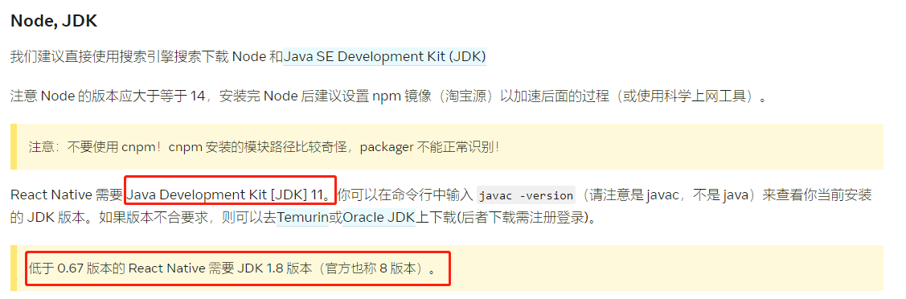

## taro 分离模式开发 app(环境安装)

### 1. 官方文档

- taro React Native 开发流程 https://docs.taro.zone/docs/react-native/#%E9%85%8D%E7%BD%AE-output
- React Native 环境配置 https://reactnative.cn/docs/next/environment-setup

### 2. Taro 安装

- 官方参考文档 https://docs.taro.zone/docs/GETTING-STARTED
- 安装 Node.js，推荐使用 Node.js 12.0 及以上版本。
- 安装 Taro 开发工具 @tarojs/cli

```
  # 使用 npm 安装 CLI
  $ npm install -g @tarojs/cli

  # OR 使用 yarn 安装 CLI
  $ yarn global add @tarojs/cli

  # OR 安装了 cnpm，使用 cnpm 安装 CLI
  $ cnpm install -g @tarojs/cli
```

- 通过 taro init 选择任意模板生成

### 3. java 环境安装

- 首先需要有 java 环境，可以通过 javac -version 查看是否安装，需要注意安装版本,这个是重点，敲黑板
  
- 安装包 https://www.oracle.com/java/technologies/downloads/#java11
- java 环境变量配置 https://blog.csdn.net/weixin_44778232/article/details/124610021

### 4. Android Studio 安装

- 下载路径 https://developer.android.google.cn/studio/
- 具体教程 https://reactnative.cn/docs/next/environment-setup
- 教程需要完成到配置环境变量 Path 即可

### 5. fork 壳工程 taro-native-shell

- 项目地址 https://github.com/NervJS/taro-native-shell
- 将壳工程的 android 文件夹在 Android Studio 中打开，然后在 Android Studio 中打开，Android Studio 会自动下载相关依赖和 sdk 等
- 运行 Android Studio 中的模拟器

### 6. 修改 Taro 项目中的./config/index.js 指定资源输出目录

- 具体的路径需要根据自己的项目路径来配置

```
  {
    rn: {
      output: {
        iosSourceMapUrl: '', // sourcemap 文件url
        iosSourcemapOutput: '../taro-native-shell/ios/main.map', // sourcemap 文件输出路径
        iosSourcemapSourcesRoot: '', // 将 sourcemap 资源路径转为相对路径时的根目录
        androidSourceMapUrl: '',
        androidSourcemapOutput: '../taro-native-shell/android/app/src/main/assets/index.android.map',
        androidSourcemapSourcesRoot: '',
        ios: '../taro-native-shell/ios/main.jsbundle',
        iosAssetsDest: '../taro-native-shell/ios',
        android: '../taro-native-shell/android/app/src/main/assets/index.android.bundle',
        androidAssetsDest: '../taro-native-shell/android/app/src/main/res'
      },
    }
  }
```

- 在 Taro 项目中运行

```
# 启动 bundle server
$ yarn dev:rn
```

- 在壳工程中运行

```
# 更新相关依赖。Taro 版本更新后执行，用于同步 peerDependencies。
$ yarn upgradePeerdeps

# 启动安卓
$ yarn android
```

### 7. 遇到的问题

- 报错：error Failed to install the app. Make sure you have the Android development
  解决方案：https://www.jianshu.com/p/e4abcaf3aab3
  尝试后无果，查看安卓文件夹下的 local.properties 中 dir 为 C\:\\Users\\EDY\\AppData\\Local\\Android\\Sdk
  和大部分在百度上的文章不同 Sdk 为小写，修改为小写后重新运行解决问题，但本地的路径确实是 Sdk 大写的,此问题很可能还是和 java 版本有关，后面修改为 java 11 后修改为 Sdk 大写后也可以运行了

- 报错：react-native ＜ 0.69 Exceptions.h:5:10: fatal error: ‘fbjni/fbjni.h‘ file not found
  解决方案：https://blog.csdn.net/weixin_42368597/article/details/127442626?spm=1001.2014.3001.5501

- 在 Taro 中使用 vue 框架构建，Taro 暂不支持 vue 编译为安卓和 ios 打包最终会显示 500 https://github.com/NervJS/taro/issues/13240

- 安装上应用后闪退
- 查看 logcat 日志，发现是堆栈报错了， fault addr 0x0 in tid 10786 (mqt_js), pid 10722
- 猜测和之前的报错有关

  ```
  BUILD FAILED in 6s

  error Failed to install the app. Make sure you have the Android development environment set up: https://reactnative.dev/docs/environment-setup. Run CLI with --verbose flag for more details.
  Error: Command failed: ./gradlew app:installDebug -PreactNativeDevServerPort=8081
  java.lang.NoClassDefFoundError: Could not initialize class org.codehaus.groovy.vmplugin.v7.Java7
  ```

- 并且无法通过 Android Studio 或命令行 运行到真机上，也无法使用命令行 正常启动项目在模拟器。
- 解决方案第三点：https://www.jianshu.com/p/851d76c2754e
- 因为我安装的 java 版本不对，需要安装 11，我安装了 17 导致的，所以需要卸载 17，安装 11，然后配置环境变量，再次运行，成功运行到
