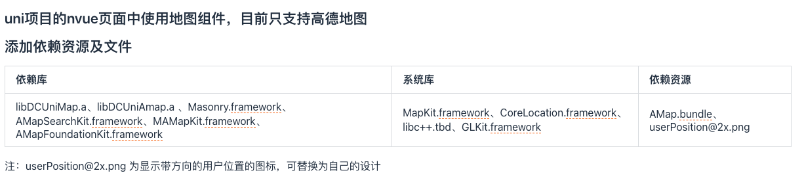
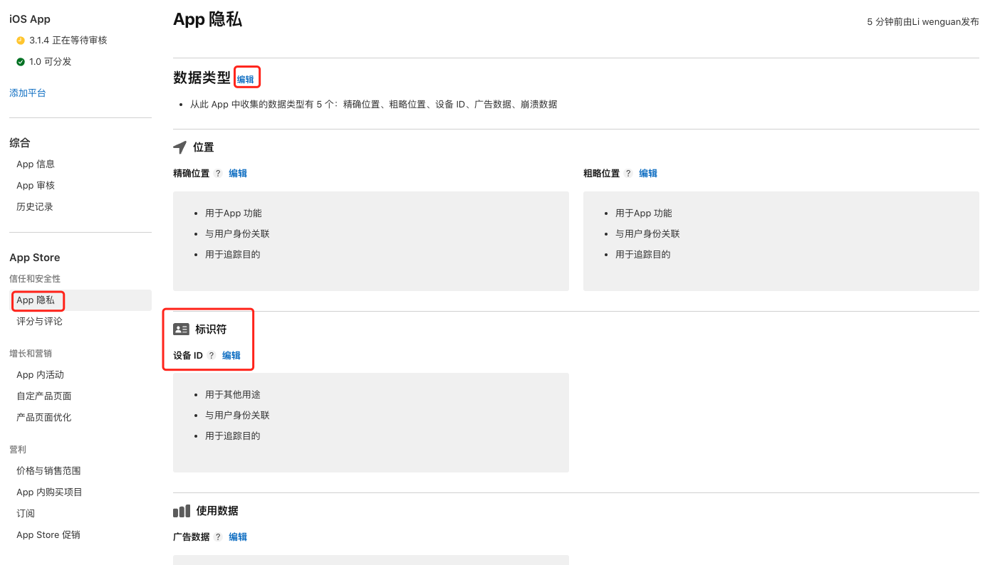
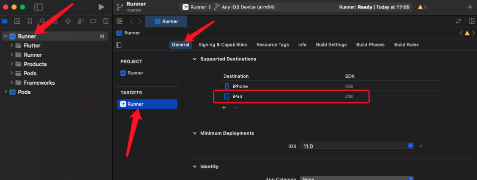
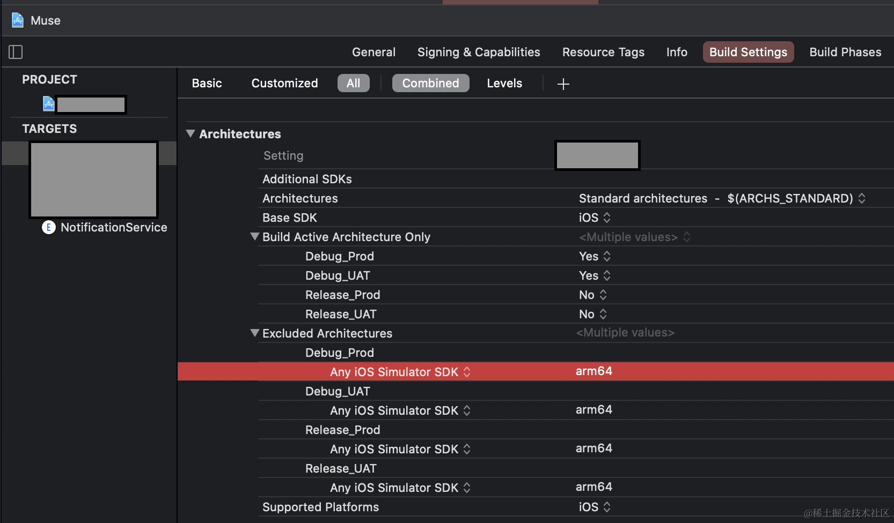

## uniapp ios 本地离线打包(攻略)

首先我们需要知道 ios 本地离线打包是什么，为什么要使用离线打包，而不使用云打包，按官方的说法"App 离线开发工具包，即 App 离线 SDK，是把 App 运行环境（runtime）封装为原生开发调用接口，开发者可以在自己的 Android 及 iOS 原生开发环境配置工程使用，包括 Android 离线开发 SDK 及 iOS 离线开发 SDK"，实际上好处有：

1. 本地打包，不需等，有时候云打包人数多时你又着急上线时结果看到需要等 30 分钟(夸张的修辞手法，一般也就 5-6 分钟)后才能打包完成，而本地打包只需要生成一下 App 资源，然后进行打包即可
2. 本地打包没有代码泄露等风险，并且不需要上传证书(虽然 uniapp 是官宣不会泄露，我也十分相信)

### 1. 基础资料

所谓"工欲善其事，必先利其器"所以我们需要先了解一些基础资料，这些资料可以帮助我们更好的理解 uniapp 的打包流程。

1. [uniapp 的离线打包流程](https://nativesupport.dcloud.net.cn/AppDocs/usesdk/ios.html)
2. [ios 离线 sdk](https://nativesupport.dcloud.net.cn/AppDocs/download/ios.html)
3. [导入 App 资源](https://nativesupport.dcloud.net.cn/AppDocs/importfeproject/ios.html)
4. [ios 模块配置](https://nativesupport.dcloud.net.cn/AppDocs/usemodule/iOSModuleConfig/common.html)
5. [打包发行](https://nativesupport.dcloud.net.cn/AppDocs/package/ios.html)
6. [ios 启动页自定义](https://ask.dcloud.net.cn/article/id-37475__page-2#reply)
   以上的这些资料，基本可以完成离线打包，但还是会遇到一些问题，接下来会列举一些我遇到的问题

#### 所需材料

1. 一个审核通过的企业开发者 developer 账号
2. 申请好证书和描述文件
3. Xcode
4. Hbuilderx

### 2. 插件配置问题

#### 2.1 高德地图配置

1. [文档]（https://nativesupport.dcloud.net.cn/AppDocs/usemodule/iOSModuleConfig/map.html#%E9%AB%98%E5%BE%B7%E5%9C%B0%E5%9B%BE-%E4%BB%85nvue%E9%A1%B5%E9%9D%A2%E6%94%AF%E6%8C%81)
2. 报错：当前运行的基座不包含原生插件[mapSearch]，请在 manifest 中配置该插件，重新制作包括该原生插件的自定义运行基。uniapp 提供的离线基座在使用 uni.chooseLocation 进行位置选择时，离线基座提示不包含原生插件。
   原因：文档下面还有一个说明配置，这些依赖库、系统库、依赖资源也需要配置
   

#### 2.2 极光推送配置

1. [文档](https://go48pg.yuque.com/go48pg/pa41sm/nnc35c?#tl39W)
2. 报错：当前运行的基座不包含原生插件[JG-JPush]，请在 manifest 中配置该插件，重新制作包括该原生插件的自定义运行基座
   按文档配置应该是没有问题的，但是还是遇到这种情况你需要看一下是否使用了模拟器运行的，使用真机运行即可

### 3. 配置 app 模块等问题

在运行中提示：打包时未添加 xxx 模块
请根据“[如何配置模块/三方 SDK](https://nativesupport.dcloud.net.cn/AppDocs/usemodule/iOSModuleConfig/common.html#%E5%A6%82%E4%BD%95%E9%85%8D%E7%BD%AE%E6%A8%A1%E5%9D%97-%E4%B8%89%E6%96%B9sdk)”配置即可

### ios 更新跳转到 App Store 指定 app 链接

iTunes 提供了接口可查询到 app 在 App Store 上的信息
国外：https://itunes.apple.com/lookup?id=xxx
国内：https://itunes.apple.com/cn/lookup?id=xxx

xxx 为你的应用 ID，可在[App Store Connect](https://appstoreconnect.apple.com/)上 APP 信息查看

1. 直接浏览器访问后会下载一个 txt 文件
2. 打开搜索 trackViewUrl，获取到参数后的内容也就是一个 https 链接
3. 将 https:// 替换为 itms:// 或者 itms-apps://
4. 验证用 ios 的手机，在 safari 打开这个链接，会弹窗提示跳转到 App Store

### 麦克风授权问题

ios 麦克风授权是弹窗提示用户开启的，添加这以下代码获取麦克风授权

```js
const appAuthorizeSetting = uni.getAppAuthorizeSetting();
const isAuth = appAuthorizeSetting.microphoneAuthorized === "authorized";
if (!isAuth) {
  if (uni.getSystemInfoSync().platform === "ios") {
    let avaudiosession = plus.ios.import("AVAudioSession");
    let avaudio = avaudiosession.sharedInstance();
    avaudio.requestRecordPermission(() => {
      console.log("授权麦克风权限完成");
    });
  } else {
    // 安卓
  }
}
```

### 离线打包自定义启动页

首先是看这个文档"[ios 启动页自定义](https://ask.dcloud.net.cn/article/id-37475__page-2#reply)",下载附件然后看附件中的 readme.md 教程进行自定义修改
修改后拖到项目根目录下，再根据"[uniapp 的离线打包流程](https://nativesupport.dcloud.net.cn/AppDocs/usesdk/ios.html)"中的启动页配置即可

### 遇到的问题

1. 在 App 提交审核是提示：你的 App 包含 NSUserTrackingUsageDescription，这表示它可能会请求追踪用户。要提交以供审核，请更新你的 App 隐私答复以注明从此 App 中收集的数据将用于追踪目的，或者更新你的 App 二进制文件并上传新的构建版本。
   原因：你在 app 中使用了如 JPush 极光、广告等，会出现此时你就需要去去更新 App 的隐私协议，然后重新打包上传即可
   

2. 解决 App Store 上架提示您必须上传 12.9 英寸 iPad Pro（第 2 代）显示屏的截屏
   原因：在项目中选择了多种平台，去项目中进行
   

3. 在配置打包证书时报错：Provisioning profile "XX" doesn't include signing certificate "xx developer<br/>
   原因：在 xcode 中选择了手动配置证书和描述文件，但并不匹配所导致<br/>
   解决方案：https://blog.csdn.net/auccy/article/details/105693590

4. 如果是在 product -> Archive 报错：Profile doesn't include the selected signing certificate.
   原因：如果在配置证书正常时，可能是钥匙串中有重复过期了证书<br/>
   解决方案：将钥匙串和本 app 有关的证书删除，重新导入后，重启 Xcode，重新打包即可

5. ios 隐私 info.plist 配置
   https://www.cnblogs.com/xiaohuizhenyoucai/p/17678763.html

6. 报错：# [Xcode building for iOS Simulator, but linking in an object file built for iOS, for architecture 'arm64'](https://stackoverflow.com/questions/63607158/xcode-building-for-ios-simulator-but-linking-in-an-object-file-built-for-ios-f)

   注：需要注意的是如果是真机调试是不需要加此选项的，只在模拟器运行时需要
   
