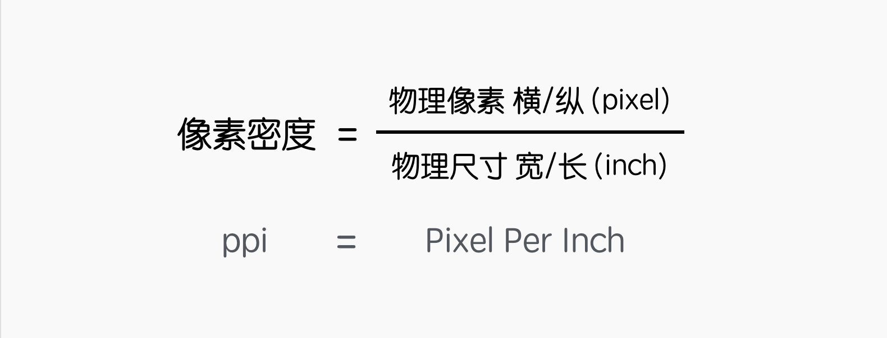

## 像素密度：清晰度的表征（一英寸界面中的像素点数）

- 像素密度是对画质的清晰、细腻、逼真的视觉感觉体验，画质是由屏幕性质决定的
- 我们知道，屏幕是由很多像素点组成的，每个点发出不同颜色的光，构成我们看到的画面。当我们眼睛的视杆细胞和视锥细胞接收到的光线越多，我们感知到的画面就会越丰富。而如果需要光线多，就需要保证像素点够多。
- 我们在计算「人口密度」时，会抓出一平方公里的地区，看里面塞了多少人，据此，判断人口的密集程度。同理，我们可以抓出一英寸的界面，看里面塞了多少个像素点，判断像素的密集程度，这就是「像素密度」。

## 像素密度计算

- 1 英寸=2.54 厘米
- 设备长、宽的实际长度，即「物理尺寸」，用勾股定理计算可得屏幕尺寸。
- 在横纵切上的像素点数，也叫「物理像素」，单位是 px。拿到这两个参数，就可以计算出「像素密度」
- 还有一种计算方法，是先算出「物理像素」的平方和，再开根号，最后除以「屏幕尺寸」。
  

- 从计算方法可以看出，像素密度就是 pixels per inch，简称：PPI。
- 值得注意的是，在 Android 系统中，除了像素密度 PPI，还有一个 DPI，也是「像素密度」，全名为：Dots per inch，两者的区别是：
    - ·PPI：表示物理像素密度，是客观存在不会改变的。
    - ·DPI：表示软件像素密度，是软件参考了 ppi 后，人为指定的一个固定值，写在系统出厂配置文件上，保证在某一个区间的 ppi 在软件上使用同一个值，它是安卓特有的。
- 所以，可能有几款安卓手机的 PPI 不同，但是 DPI 相同。比如，有 3 款相同分辨率不同尺寸手机的 ppi 可能分别是 430,440,450，那么在 Android 系统中，可能 dpi 会全部指定为 480，以保证相同分辨率手机的表现一致。
- 苹果手机型号有限，所以没有 DPI 的概念，全部用 PPI 表示

## 像素密度的作用？

- 「像素密度」是连接数字世界和物理世界的桥梁。它是设备的固有属性，反映了屏幕呈现影像细节的能力。像素密度越高，屏幕显示的密度越高，拟真度就越好。Retina 屏比普通屏清晰，就是因为它的像素密度翻了一倍。
- 我们可以根据「像素密度」判断屏幕显示质量的好坏。iPhone 3gs 和 iPhone 4 物理尺寸相同，但是后者的 ppi 为 326，是前者 163 的两倍，分辨率也是两倍的关系，说明 4 的呈像能力更佳。同时也可以看出，手机屏幕的物理尺寸和像- 素尺寸是不成比例的。
- 总结：只要两款手机的「像素密度」相同，它们的显示「精细程度」就是相同的。
