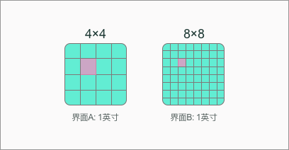

## 逻辑像素：空间容纳度

在界面 A（1 英寸，4x4 px）上放一个 1×1 像素的红方格，然后把它移动到同样尺寸、2 倍像素密度的界面 B（1 英寸，8x8 px）上，如下图所示。

对比界面 A 和 B，B 的「像素密度」更大，「界面-物理像素」也更大。

红方格在移动过程中，方格的「物理像素」不变，方格的「物理尺寸」变小。

「物理尺寸」是我们唯一肉眼可以观察到的属性，我们的目标是让红方格的变化过程符合常识，也就是保持红方格的「物理尺寸」不变。根据「像素密度」的计算公式，红方格物理尺寸一定时，当像素密度变成 2 倍，在界面 B 中的红方格的物理像素就必须变成原来的 2 倍。

物理尺寸一样，红方格在界面 A 和界面 B 中显示的内容物的多少就是一样的。为了标记这种“不同分辨率界面呈现同样多内容显示效果”的能力，我们引入一个抽象概念，它就是「逻辑像素」。我们约定把界面 A 的物理像素作为基准，界面 B 可用对应的像素乘以倍数得出，A 和 B 的显示范围是一样的。这个基准就是逻辑像素

现在，我们再次把红方格，从界面 A 移到界面 B，因为界面 B 的像素密度是界面 A 的 2 倍，为了红方格在两个界面中肉眼可见的大小排版一致，根据公式，红方格在界面 B 中占据的物理像素是界面 A 中的 2 倍，如下图所示：  

