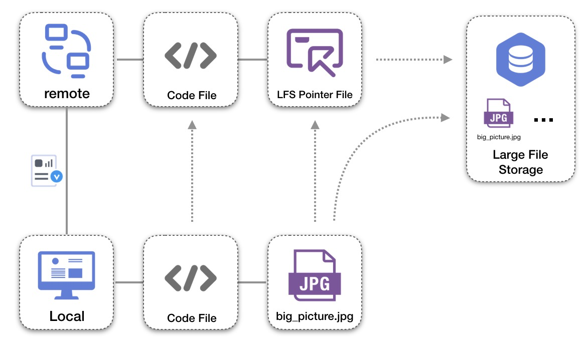
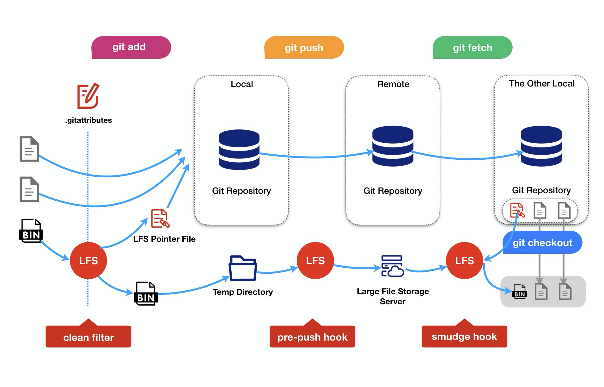

## Git LFS 大文件存储

### 1.Git LFS 由来

众所周知我们已经有 Git，那为什么还需要个 Git LFS 呢？Git 为分布式控制工具，本地仓库与远端仓库同样保存了全量的文件和变更历史。但也正因为如此，Git 针对大型文件（例如图片、视频或其他二进制文件）的版本控制，也会存在一些问题，主要有两点： 

1. 效率变慢：不管实际上用户是否使用到这些大文件的历史，都需要把每一个文件的每一个版本下载到本地仓库。毫无疑问，下载耗时的增加给用户带来了更多的等待时间。
2. 空间变大：一个 Git 仓库存放的大型的文件越多，加之伴随着其关联提交不断增多，Git 仓库会以非常快的速率膨胀，占用更多的磁盘空间。 
   针对上述的问题，Git LFS 应运而生，是目前针对大文件场景下的主流的解决方案。

### 2.Git LFS 优缺点

优点： 

1. 更大：支持 GB 级别的大文件版本控制。
2. 更小：让 Git 仓库空间占用减小。
3. 更快：仓库的克隆和拉取更快。
4. 透明：Git 使用上对用户完全透明。
5. 兼容：权限控制上完全兼容（兼容 Codeup 权限控制）。

缺点： 

1. 版本过低导致的报错异常（Git 相关软件版本过低可能导致 Git LFS 功能无法正常使用，最好版本在 git2.0 以上）
2. 未安装 git-lfs 导致无法完整拉取文件（windows 是自带的，其他的操作系统需要安装 git-lfs）

### 3.如何使用 Git LFS

#### 3.1 安装 Git LFS

1. Linux Debian 和 RPM packages：https://packagecloud.io/github/git-lfs/install
2. Mac: brew install git-lfs
3. Windows：目前 lfs 已经集成在了 Git for Windows 中，直接下载和使用最新版本的 Windows Git 即可。

#### 3.2 让仓库支持 LFS

1. 在仓库中执行 git lfs install
2. 如需要将.png 文件使用 Git LFS，可以执行 track 命令进行追踪：git lfs track "_.png"这里需要注意。如果是需要某个文件夹下的所有文件都需要使用 Git LFS，那么需要使用如下命令：git lfs track "path/to/folder/\*\*"（撤销可以使用 git lfs untrack "_.png"命令）
3. 将.gitattributes 文件和生成的 git hook 文件，执行 git add .和 git commit
4. 然后此时再添加新的符合规则的文件，git add .后可使用 git lfs ls-files 查看是否添加成功
5. 后面就是正常的 git push 操作了

#### 4.LFS 原理

##### 4.1 Git LFS 场景

图片所示，我们可以针对 jpg 图片使用 Git LFS 的存储能力，在 push 过程中将其上传至大文件存储服务。同时，大文件对应的指针文件将连同其他的普通的代码文件推送到远端 Git 仓库中。

##### 4.2 Git LFS 处理流程

