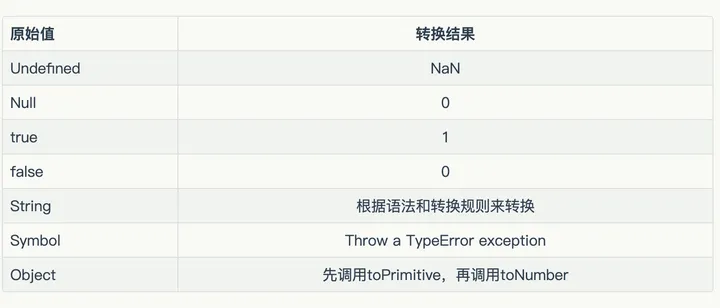
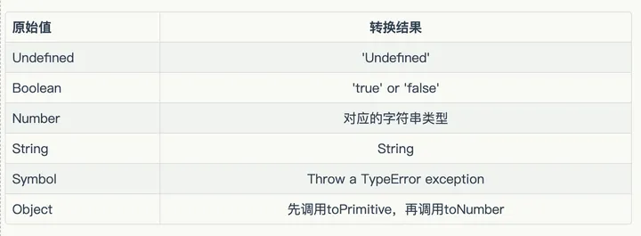
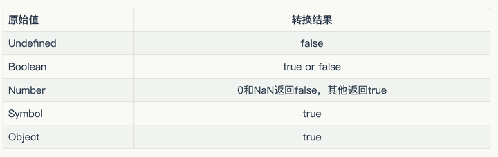

## js 类型基础知识

### 一、认识类型

在我们日常编程中，无论是初学者还是有经验的开发人员，都离不开对 JavaScript 类型的理解和使用。这篇文章将深入解析 JavaScript 类型的基础知识，包括类型的判断，类型转换，以及 JavaScript 如何存储数据等等。让我们开始我们的学习之旅吧

#### 1. js 内置类型

分为原始类型和引用类型
原始类型（基本数据类型）：string、number、boolean、null、undefined、Symbol、BigInt
引用类型：Object(Array、Function、Date、Math、RegExp)

#### 2. js 数据是如何存储

原始类型存在栈中，引用类型指针存在栈中，而值存在堆中。
原始类型被引用或拷贝时，会创建一个完全相等的变量，因为原始类型的占用空间小，大小固定。
引用类型堆的指针地址存在栈中，值存在堆中，根据指针地址去堆中找到相对应的值

#### 3. 深入理解 js 执行过程的存储

在 js 执行过程中，有三种类型的内存空间，分别为代码空间、栈空间、堆空间。代码空间存储的为可执行代码。
栈中存储着原始类型值和引用类型的值的对地址，引用类型值存在堆中，所以当 js 访问引用了类型时是通过栈中的地址去找到堆中的值

js 引擎需要使用到栈来维护执行期间的上下文状态，如果栈空间太大，没有引用类型，所有的数据都放在栈中，会导致影响上下文切换的速率，导致执行效率低下，所以栈一般不会设置太大，存一些原始类型的小数据。
但这样做也有缺点因为分配和回收内存会相对复杂，会占用一定的时间

#### 4. null 和 undefined 的区别

undefined 代表未定义，null 代表空对象（并不是真的对象），一般情况下变量声明了但没有定义返回会使用 undefined，null 主要用在赋值给可能返回对象的变量，作为初始化的使用

> null 并不是真的对象，虽然 typeof null 会输出 Object，但这个 js 中的一个 bug，在 JS 的最初版本中使用的是 32 位系统，为了性能考虑使用低位存储变量的类型信息，000 开头代表是对象，然而 null 表示为全零，所以将它错误的判断为 object

undefined 并不是保留字，所以 undefined 可以做为变量，这会影响对 undefined 的判断，非常的危险，那么我们应该如何更好的获取安全的 undefined 值呢？答案是 void 0;

### 二、类型的判断

让我们简单了解一下都有哪些判断类型的方法

#### 1. typeof

typeof 可以判断原始类型，除了 null，null 会被判断为 object，但可判断 function

#### 2. instanceof

instanceof 可以判断对象，机制是通过判断对象原型链中是不是找到类型的 prototype

拓展实现 instanceof

```js
function myInstanceOf = (target, obj) {
  let proto = Object.getPrototypeOf(target);
  while (proto !== null) {
    if (proto === obj.prototype) return true;
    proto = Object.getPrototypeOf(proto);
  }
  return false
}
```

#### 3. constructor

在没有被修改原型下，constructor 可以判断到正确的类型，但一旦原型被修改则会显示为修改后的类型，所以并不可靠

```js
function Fn() {}

Fn.prototype = new Array()

var F = new Fn()

console.log(F.constructor === Fn) // false
console.log(F.constructor === Array) // true
```

#### 4. Object.prototype.toString.call()

返回当前实例所属类信息，可以很好的判断引用类型

#### 5. 实现通用的判断类型方法

```js
function getType(date) {
  const type = typeof date
  if (type !== "object") {
    return type
  }
  return Object.prototype.toString.call(date).slice(8, -1)
}
```

### 三、类型转换

js 类型转化经常让人摸不着头脑，比如非常经典的('b'+'a'+ +'a'+'a').toLowerCase()，此时你是否已经打开 F12,复制执行了，那就证明你需要好好的看一下以下的文章啦，深入的了解一下 js 的类型转换，实际的返回值为"banana"

#### 1. 显式类型转换

即手动的将值类型转为另外的值类型, 一般情况下类型转换主要为基本类型转基本类型，复杂类型转基本类型

##### 1.1 toNumber


这里所写的 ToPrimitive 后面会做介绍
这里需要重点介绍 String 转为 Number 的规则：

1. 如字符串中只有数字，则返回对应数字
2. 如字符串只有 16 进制的格式的，会转为 10 进制数字
3. 如果为空，则是 0
4. 其他情况都为 NaN

##### 1.2 toString


可使用${}、String()构造函数

##### 1.3 toBoolean


使用 Boolean()构造函数手动转换，null 也为 false

#### 2. 隐式类型转换（ToPrimitive）

隐式类型转换一般在运算符是出现，如两个变量相加减，或比较是否相等

在对象转为原始类型时，会调用内置的 ToPrimitive 方法，而 ToPrimitive 会调用 OrdinaryToPrimitive 方法

> 这里解释一下 ToPrimitive 函数的算法逻辑
>
> - 已经是原始类型不需要转换
> - 调用 x.valueOf()，如果为原始类型就返回
> - 调用 x.toString(),如果为原始类型就放回
> - 如果没有原始类型报错
> - 可重写 Symbol.toPrimitive，优先级最高，如下

```js
let x = {
  valueOf() {
    return 0
  },
  toString() {
    return "99"
  },
  [Symbol.toPrimitive]() {
    return 4
  }
}

100 + x // 104
```

##### 2.1 四则运算符

- 运算中有一个为字符串，那么就会把另一个也转换为字符串
- 如否都不是字符串或者数字，则转换为数字或者字符串
- 对于除加法的运算符，只要其中一个为数字，那么另一个就会被转为数字

> 需要特别注意的是'a'+ + 'b',结果为"aNaN", 因为 + 'b' 等于 NaN，所以结果为 "aNaN"

```js
2 * "4" // 8
2 * [] // 0
2 * [3, 4] // NaN
```

##### 2.2 比较运算符

- 如果为字符串，则使用 unicode 字符索引进行比较
- 如果是对象，则通过刚刚介绍的 toPrimitive 对象转化

##### 2.3 Object 的转换

Object 的转换就是通过 toPrimitive 进行的，所以和上面介绍的 toPrimitive 函数的算法逻辑一致

##### 2.4 '==' 的隐式类型转换

- 类型相同则不转换
- 两个对比对象如果为 string 和 number，则转为 number 后判断
- 有一个为 boolean，转为 number
- 有一个为 object，则通过 toPrimitive 函数转为原始类型后判断
- 有 Symbol 则返回 false
- 有一个为 null 或 undefined,则了另外一个为 null 或 undefined，则为 true，反之为 false

##### 2.5 '+' 的隐式类型转换

- 如有一个为字符串，另一个为 undefined、null 或布尔型则调用 toString() 方法进行字符串拼接。如是纯对象、数组、正则等，则默认调用对象的转换方法会存在优先级，然后再进行拼接。
- 如有一个是数字，另外一个是 undefined、null、布尔型或数字，则会将其转换成数字进行加法运算，对象的情况还是参考上一条规则。
- 如有一个是字符串、一个是数字，则按照字符串规则进行拼接

### 四、结束

看到这里应该都已经明白 js 的类型是怎么回事了吧。我们已经一起深入了解了 js 的类型基础知识，包括内置类型，数据存储方式，类型的判断以及类型转换等等。希望这篇文章能帮助你在编程的道路上更进一步，加深你对 JavaScript 类型的理解
