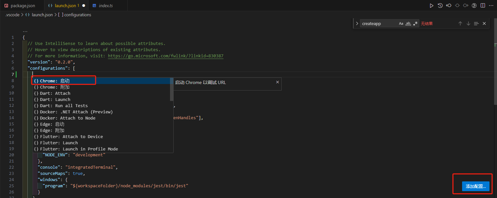
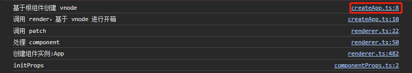

## (一)Vue3 源码 探秘之旅：如何调试和阅读

### 前言

嘿，各位前端探险家们！欢迎加入 Vue3 源码的探秘之旅！在这次探险中，我们将通过调试和源码来揭示 Vue3 的神秘面纱，带你踏上 Vue3 的源码之旅。别担心，不会让你沦为源码的难民，而是会用轻松幽默的方式，让你在调试和源码阅读中玩得风生水起！

### 一、如何阅读源码

我们有两种方式来阅读源码:

1. 将[Vue3 源码](url: https://github.com/vuejs/core)clone下来，然后打断点进行调试
2. clone 阿崔 cxr 大佬写的精简版的[mini-vue](url: https://github.com/cuixiaorui/mini-vue)源码版本，这个库的就是把 vue3 源码中最核心的逻辑剥离出来，只留下核心逻辑，并且还添加了很多注释，更好的去理解源码

对于并不太了解如何阅读源码，建议的方式是同时食用两种方式，将 mini-vue 作为主要的源码阅读，然后根据理解再阅读一遍 Vue3 的源码，因为 mini-vue 能带你更好的入门，而 Vue3 源码则是可以看看边界情况等等的处理。可以通过在 mini-vue 的方法名称直接在 Vue3 源码中找到

### 二、mini-vue 源码调试和 Vue3 源码调试

1. mini-vue 源码调试(google 调试)

- pnpm i 安装好依赖
- pnpm dev 编译 vue
- 使用[Live Server](url: https://marketplace.visualstudio.com/items?itemName=ritwickdey.LiveServer)运行项目
- 通过 server 的方式打开 packages/vue/example/\* 下的 index.html 即可，然后就会发现有页面和打印，在关键节点上的打印可以直接映射到源码位置，然后就可以直接使用 google 打断点调试啦

2. Vue3 源码调试(vscode 调试)

- pnpm i 安装好依赖
- pnpm run dev -s 编译
- pnpm run serve 运行 demo
- 点击 Vs Code 调试工具，选择设置 launch.json
  
- 点击添加配置，选择 Chrome 启动选项
  
- 添加后生成的代码，修改端口号为一开始为 demo 的端口
  
- 修改调试的配置为刚刚添加的 Chrome 启动
  
- Vue3 的例子全部都在/packages/vue/examples/文件夹下，尝试添加一个断点在/packages/vue/examples/classic/todomvc.html 文件中
  
- 然后点击开始按钮即可打断点调试啦
  

两种调试的方式都可以使用，看个人喜好，在 mini-vue 中可以直接点击打印的源码位置，可以直接看到关键节点的源码


### 三、首先我们要阅读源码需要知道 Vue3 和 Vue2 做了哪些提升

1. 在 vue3 中项目管理使用了 monorepo 的代码管理方式，让我们来看看大致的目录吧
   monorepo 的好处：

- 每个 package 有个各自的 API、类型定义、测试
- monorepo 的好处在于将模块拆分的更细化，职责划分更明确，模块之前的依赖关系也更明确
- 开发人员更容易的约阅读、理解和查看所有源码模块，提高了维护性
- package 下的库(如 reactivity)是可以独立的使用的，并不依赖于 vue，这样如果单独想要响应式的能力不需要引入整个 vue，减少引入包的体积

2. 使用 TypeScript 进行开发(更好的类型推导)

- Flow 静态类型检查工具，小成本在 js 代码上迁入（复杂类型无法推导）

```js
const propOptions: any = vm.$options.props;
```

### 三、简单来个 Vue3 初始化过程看看

1. 首先我们先看 mini-vue 源码，找到 packages\vue\example\helloWorld\main.js 可以看到 createApp(App).mount(rootContainer);是否似曾相识，没错这就是我们平常开发中所做的应用实例创建，然后接着向下看可以看到在 packages\runtime-dom\src\index.ts 中的 createApp 函数这里做了两件事情：创建渲染器和创建 App 实例，接下来我们就来一探究竟 ensureRenderer 中的 createApp
   
   ensureRenderer 由函数 createRenderer 创建，我们看到 createRenderer 中的 createApp 由 createAppAPI(render)，createAppAPI 可以看到
   位运算

进入 createApp 可以看到调用的是 createAppAPI(render)，可以看到是 createVNode,这个就是 Vue 中的创建虚拟 DOM 的关键了


