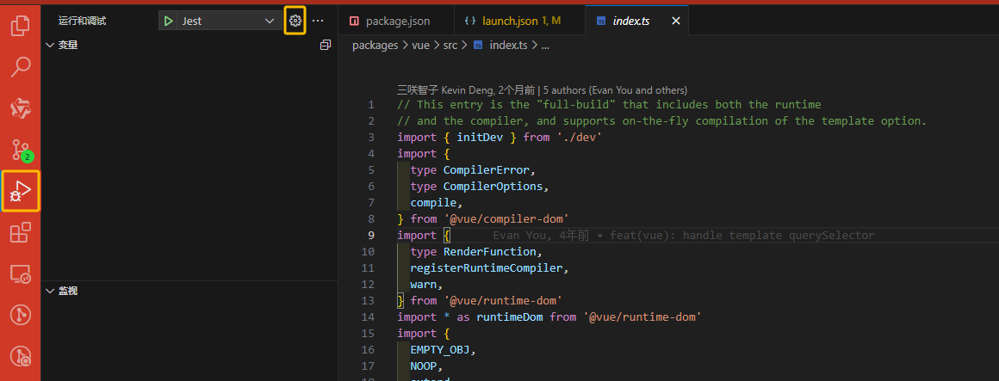
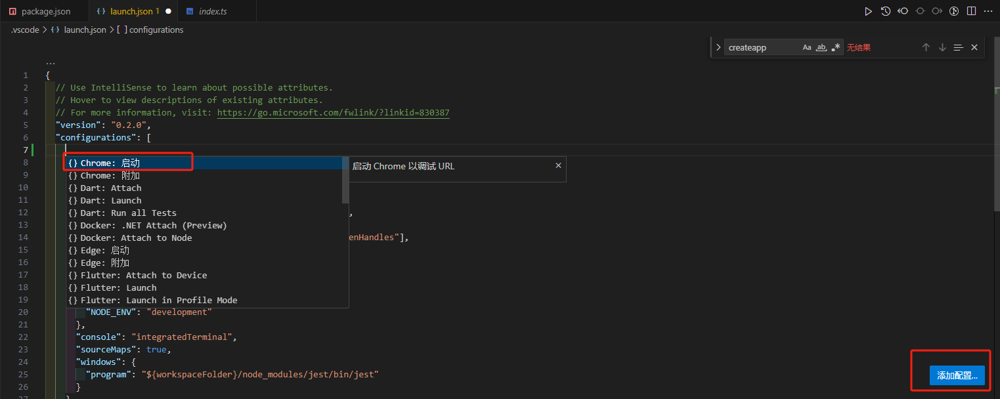
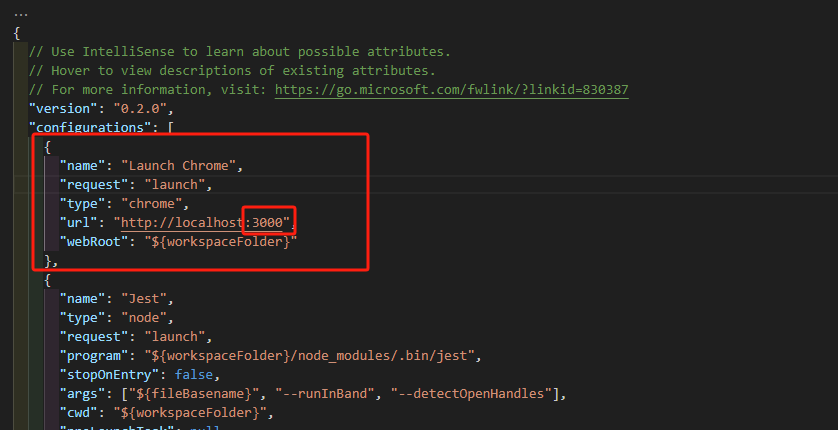
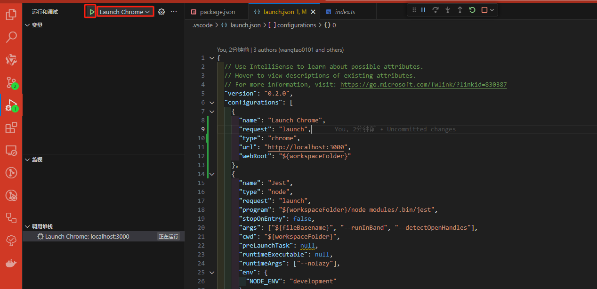
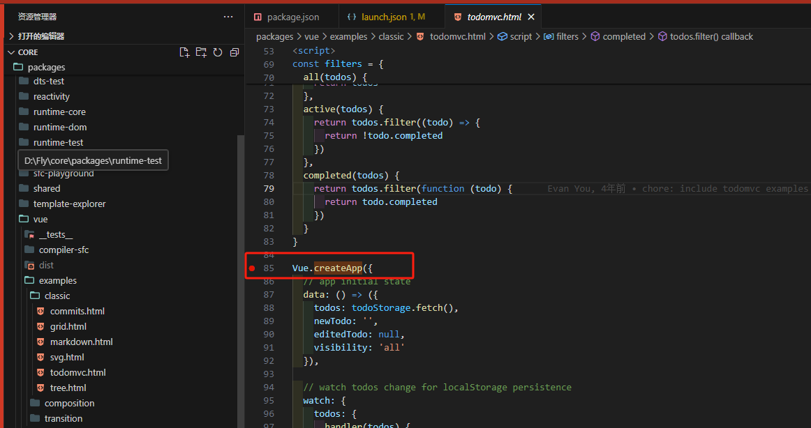
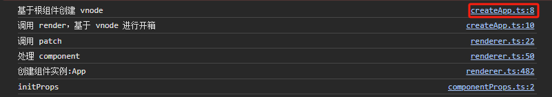

## (一)Vue3 源码 探秘之旅：调试阅读与新特性简介

### 前言

嘿，各位前端探险家们！欢迎加入 Vue3 源码的探秘之旅！在这次探险中，我们将通过调试和源码来揭示 Vue3 的神秘面纱！

### 一、如何阅读源码

我们有两种方式来阅读源码:

1. 将[Vue3 源码](url:https://github.com/vuejs/core)clone 下来，然后打断点进行调试
2. clone 阿崔 cxr 大佬写的精简版的[mini-vue](url:https://github.com/cuixiaorui/mini-vue)源码版本，这个库的就是把 vue3 源码中最核心的逻辑剥离出来，只留下核心逻辑，并且还添加了很多注释，更好的去理解源码

对于并不太了解如何阅读源码，建议的方式是同时食用两种方式，将 mini-vue 作为主要的源码阅读，然后根据理解再阅读一遍 Vue3 的源码，因为 mini-vue 能带你更好的入门，而 Vue3 源码则是可以看看边界情况等等的处理。可以通过在 mini-vue 的方法名称直接在 Vue3 源码中找到

### 二、mini-vue 源码调试和 Vue3 源码调试

1. mini-vue 源码调试(google 调试)

- pnpm i 安装好依赖
- pnpm dev 编译 vue
- 使用[Live Server](url:https://marketplace.visualstudio.com/items?itemName=ritwickdey.LiveServer)运行项目
- 通过 server 的方式打开 packages/vue/example/\* 下的 index.html 即可，然后就会发现有页面和打印，在关键节点上的打印可以直接映射到源码位置，然后就可以直接使用 google 打断点调试啦

2. Vue3 源码调试(vscode 调试)

- pnpm i 安装好依赖
- pnpm run dev -s 编译
- pnpm run serve 运行 demo
- 点击 Vs Code 调试工具，选择设置 launch.json
  
- 点击添加配置，选择 Chrome 启动选项
  
- 添加后生成的代码，修改端口号为一开始为 demo 的端口
  
- 修改调试的配置为刚刚添加的 Chrome 启动
  
- Vue3 的例子全部都在/packages/vue/examples/文件夹下，尝试添加一个断点在/packages/vue/examples/classic/todomvc.html 文件中
  
- 然后点击开始按钮即可打断点调试啦
  

两种调试的方式都可以使用，看个人喜好，在 mini-vue 中可以直接点击打印的源码位置，可以直接看到关键节点的源码


### 三、首先我们要阅读源码需要知道 Vue3 和 Vue2 做了哪些提升

#### 1 在 vue3 中项目管理使用了 monorepo 的代码管理方式，让我们来看看大致的目录吧

monorepo 的好处：

- 每个 package 有个各自的 API、类型定义、测试
- monorepo 的好处在于将模块拆分的更细化，职责划分更明确，模块之前的依赖关系也更明确
- 开发人员更容易的约阅读、理解和查看所有源码模块，提高了维护性
- package 下的库(如 reactivity)是可以独立的使用的，并不依赖于 vue，这样如果单独想要响应式的能力不需要引入整个 vue，减少引入包的体积

#### 2. 使用 TypeScript 进行开发(更好的类型推导)

- Flow 静态类型检查工具，小成本在 js 代码上迁入（复杂类型无法推导）

```js
const propOptions: any = vm.$options.props
```

#### 3. Vue3 源码体积减少

- 移除冷门的 feature
- 引入 tree-shaking 技术
  通过 ES2015 模块语法（import 和 export）通过编译阶段的静态分析，找到没有引入模块并打标记，在编译阶段也会将代码剔除
  项目中没有引入到的组件不会进行打包，减少包体积（如 keepAlive 等）

#### 4. 响应式优化（数据劫持访问和更新）

- 问题：如何知道更新哪里的 DOM？
  因为在渲染 DOM 的时候访问了数据，我们可以对它进行访问劫持这样就在内部建立依赖关系，也就知道数据对应的 DOM 是什么

- Vue2 通过 Object.defineProperty 中的 getter 和 setter 属性进行数据劫持
  缺陷：需要知道所要劫持的 key 是什么(对象属性的添加和删除)，无法在运行时判断哪些会访问所以需要递归的进行劫持(性能)

- Vue3 同个 Proxy 进行数据劫持（对整个对象进行劫持）
  注意：Proxy 不能监听到内部深层次的对象变化，因此是在 getter 中递归劫持，当访问时会进行响应式，而不是递归

#### 5. 编译优化

##### 5.1 通过编译阶段优化编译的结果，实现运行时 patch 过程的优化

Vue2 数据更新并出发重新渲染的粒度是组件级的，导致的问题当组件中只有一个动态模板时，也会遍历整个组件，导致性能的浪费
Vue3 通过编译阶段对静态模板的分析，编译生成了 Block tree（把 DOM 结构可能发生改变的地方作个动态节点收集），通过 Block tree，
将 vnode 更新性能由模板整体的大小变为了与动态内容的数量相关

##### 5.2 编译阶段和运行阶段（编译时和运行时）

编译阶段就是把编写的模板代码转为 render 函数，render 函数返回结果是个虚拟 Node
运行阶段就是把虚拟 Node 转为真实 Node 进而根据情况对 DOM 树进行挂载或者更新

##### 5.3 其他优化

Slot 编译优化、事件侦听函数缓存优化、运行时重写 diff 算法

#### 6. 语法优化 Composition API

##### 6.1 代码组织结构

Vue2 的 Options API 实际上就是编辑一个描述组件选项的对象
缺点：无法聚焦关注点，同个功能的代码被分散，会不断是上下切换
Vue3 的 Composition API 是将某个逻辑关注点相关的代码放在一个函数中

##### 6.2 逻辑复用

Vue2 中我们使用 mixins 来进行代码抽离和复用
缺点：命名冲突，ts 类型无法推导，无法进行溯源
Vue3 因为是 Composition API 调用的都是函数，有更好的类型支持，也有更好的 tree-shaking

### 四、结束语

Vue3 的升级和变更无疑为前端开发者们带来了更为强大、灵活且高效的工具。通过深入研究其源码，我们能够一窥 Vue3 内部机制的奥秘，理解其性能提升和功能增强的原因。源码的阅读和调试，不仅是对 Vue3 的深入了解，更是对我们自身技术能力的挑战和提升。
在这段探秘之旅中，我们共同见证了 Vue3 的诸多改进和优化，无论是使用 Proxy 实现响应式，还是引入 Composition API 提升代码的可维护性，都展现了 Vue 团队对于前端技术的深入理解和创新思考。
然而，源码的学习和理解并非一蹴而就的过程，它需要我们持之以恒地探索和实践。在未来的日子里，我们还将继续深入 Vue3 的源码，挖掘其更多的秘密，探索其更多的可能性。
最后，感谢各位前端探险家们的陪伴和支持。让我们携手前行，在 Vue3 的世界里不断探险、学习和成长。期待在未来的日子里，我们能够共同见证更多前端技术的辉煌成就！
