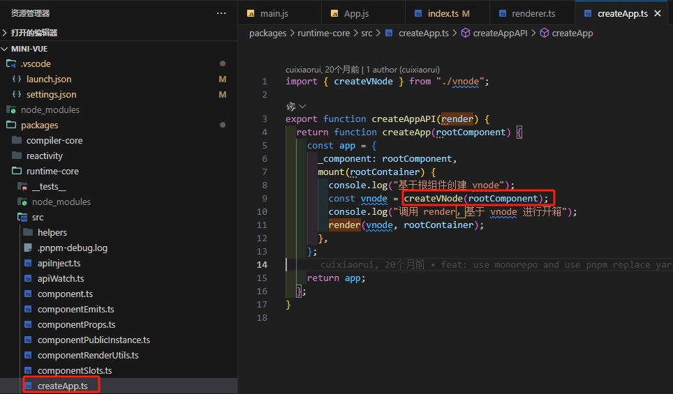

### 三、简单来个 Vue3 初始化过程看看

1. 首先我们先看 mini-vue 源码，找到 packages\vue\example\helloWorld\main.js 可以看到 createApp(App).mount(rootContainer);是否似曾相识，没错这就是我们平常开发中所做的应用实例创建，然后接着向下看可以看到在 packages\runtime-dom\src\index.ts 中的 createApp 函数这里做了两件事情：创建渲染器和创建 App 实例，接下来我们就来一探究竟 ensureRenderer 中的 createApp
   
   ensureRenderer 由函数 createRenderer 创建，我们看到 createRenderer 中的 createApp 由 createAppAPI(render)，createAppAPI 可以看到
   位运算

进入 createApp 可以看到调用的是 createAppAPI(render)，可以看到是 createVNode,这个就是 Vue 中的创建虚拟 DOM 的关键了

